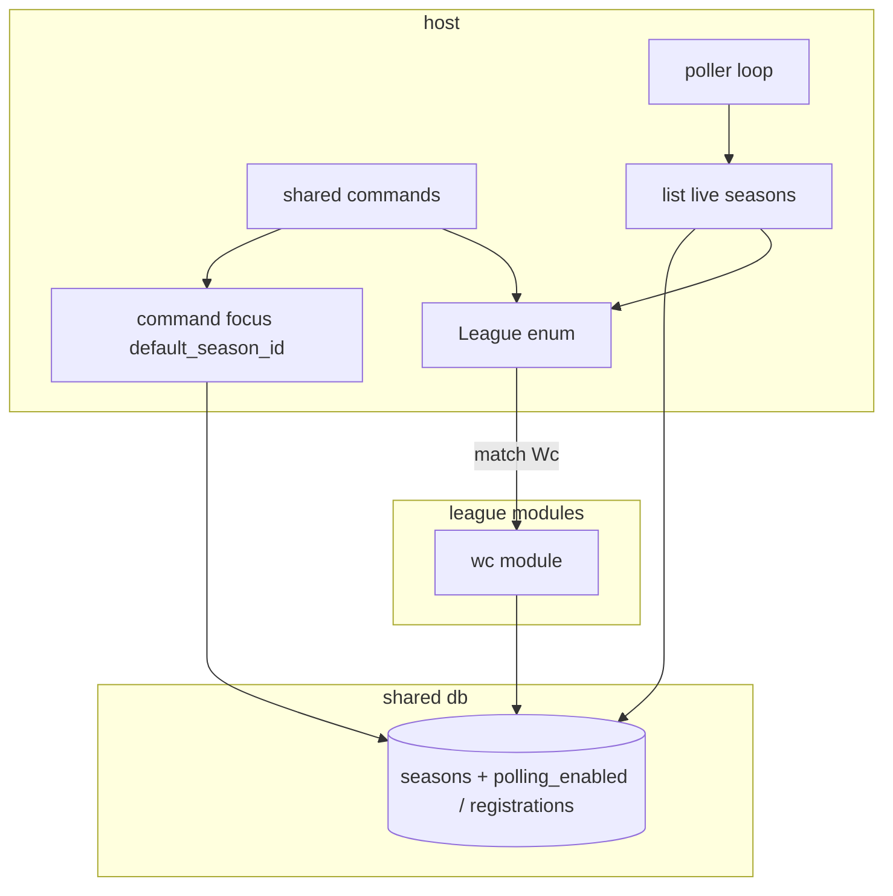

# Plan: multi-sport-framework

**Approved:** 2026-07-17

## Status

- [x] PR 1: League enum + compile-time gate
- [x] PR 2: Live seasons vs command focus
- [x] PR 3: Peel shared host off WC types
- [x] PR 4: Command assembly via League match (`commands_for`)
- [x] PR 5: Poller dispatches via League::poll
- [x] PR 6: Docs + add-a-league checklist

## Goal

Host dispatches through a `League` enum into per-league modules so adding a league is compile-time (variant + module + `match` arms). Seasons remain runtime data. WC is the reference league module. No backward-compat constraint.

## Terminology

| Term | Meaning |
|------|---------|
| **League** | Catalog / compile-time type (`leagues` row, `League` enum, slug) |
| **Season** | Runtime instance per guild (`season_id`) |
| **League module** | Code behind one league (`wc::`, later `nfl::`, …) |
| **Command focus** | Guild’s `default_season_id` (slash commands) |
| **Live season** | Season with polling/background enabled (independent of command focus) |

## Architectural decisions

1. League unit = one slug / one `League` variant; code in a league module.
2. Host owns Discord shell, season/config, shared commands, poller loop; league modules own API, league DB, ingest, standings/tie-break, league-only commands.
3. Dispatch via `League` enum (inherent methods + exhaustive `match`) — not `dyn` registry.
4. League-owned tables; host sees DTOs only.
5. `Data` = `db` + shared HTTP; league modules read their own env/tokens.
6. Shared commands use command focus; background jobs use live seasons.
7. Capability surface = methods on `League`, not host-visible trait objects.

## Design decisions

1. `League` enum — `from_slug`, `slug`, `list_teams`, `poll`, `standings`, tie-break helpers, `commands()`, etc.
2. League module — plain functions called only from enum `match` arms.
3. Live vs focus — `default_season_id` = commands only. Season gets `polling_enabled` (bool, v1). Poller loads live seasons only → group by league → `league.poll(...)`. Inactive league in practice = no live seasons for that slug.
4. Defer admin UX to create seasons / flip live; framework only defines the filter seam. Interim: existing seasons default to live.
5. Scoring — shared pure helpers optional for modules.
6. DB — unclaim/delete clears tie-breaks via `League` methods, not `Wc*` in shared registration.
7. Season setup gate — `League::from_slug(slug).is_some()` (compile-time).

## Approach

Add `League` + method faces; point registration/standings/commands at enum + command focus; point poller at live-season query + enum; reshape WC into the first league module; drop host `soccar_api()` / WC types from shared paths; document compile-time “add a league” vs runtime seasons.

## Boundaries

| Layer | Owns |
|-------|------|
| Host | `League` enum, shared commands, config, poller loop, live-season selection, `Data` |
| League modules | API, `db/<slug>/`, poll/standings/tie-break, league commands |
| Shared `db` | leagues catalog, seasons (+ live flag), guild_config, teams, registrations |
| Shared `scoring` | Pure helpers |

## Contracts

```
League::from_slug(slug) -> Option<League>
  invariant: season setup allowed iff Some  // compile-time gate

Commands → Season::default_for_guild  // command focus only

Poller → list_live_seasons_with_meta() -> [SeasonMeta]
  invariant: ignores default_season_id; only polling_enabled seasons
  then group by league slug → League::from_slug → league.poll(ctx, seasons)

league.list_teams / standings / clear_picks_for_team / …
  invariant: host does not touch league SQL tables

commands::all() = shared ++ flatten(each League variant’s commands())
```

## Investigation

- `poller.rs` — live filter + `League::poll` (stop using command focus; stop `match "wc"` strings)
- `standings.rs`, `registration.rs`, `db/registration.rs`, `types.rs` — peel WC types
- `db/league.rs` / `db/season.rs` — season setup via enum; add `polling_enabled` + `list_live_*`
- WC: `api/football_data.rs`, `soccar.rs`, `db/wc/`, `wc/`, `commands/wc/`
- Command structure: meta + config + shared gameplay (focus) + per-league commands from `League::commands()`

## Diagram



## Increments

### PR 1: League enum + compile-time gate

- **Story:** Host can resolve a slug to `League` and gate season setup on compiled-in leagues only.
- **Edits:** Introduce `League` (`from_slug`, `slug`, `display_name`, `all()`); gate `/config season` and `/config league` via enum; leave behavior otherwise unchanged.
- **Depends on:** none
- **Acceptance:**
  - [ ] `League::from_slug("wc")` is `Some`; unknown / not-in-enum slugs are `None`
  - [ ] `/config season` and `/config league` still allow only compiled leagues (same UX, new gate)
  - [ ] `cargo test` / `clippy -D warnings` pass
- **Touch set:** new `src/league.rs` → enum face; `src/commands/config.rs` → gate; `src/db/league.rs` / `src/db/mod.rs` → remove old `supports_season`; `src/lib.rs` → mod; `AGENTS.md` → league vs season + enum note

### PR 2: Live seasons vs command focus (schema + query)

- **Story:** Poller selection is independent of `default_season_id`.
- **Edits:** Add `polling_enabled` on `seasons` (default true); `Season::list_live_with_meta()`; poller uses that list (still WC-only impl inside).
- **Depends on:** PR 1 merged
- **Acceptance:**
  - [ ] Fresh DB: new seasons are live by default
  - [ ] Migration: existing seasons become live
  - [ ] Poller iterates only live seasons; focus-only changes do not affect the set
  - [ ] Tests cover list/filter; clippy clean
- **Touch set:** `src/db/migrate.rs`, `src/db/season.rs`, `src/poller.rs` (query only), `src/db/README.md`, migrate tests

### PR 3: Peel shared host off WC types (seams for enum methods)

- **Story:** Shared registration / standings / unclaim no longer import `Wc*` or `soccar_api()`; they go through `League` methods (WC arms still call today’s code).
- **Edits:** Add `League` methods needed by host; move WC call bodies behind `League::Wc` arms; thin shared use cases.
- **Depends on:** PR 1 merged
- **Acceptance:**
  - [ ] `Wc` types gone from `registration.rs`, `standings.rs`, `db/registration.rs`, `types.rs` (WC only under league module / enum arms)
  - [ ] Claim / standings / unclaim / pick-player still work for WC-focused seasons
  - [ ] Tests + clippy pass
- **Touch set:** `src/league.rs`; `src/registration.rs`; `src/standings.rs`; `src/db/registration.rs`; `src/types.rs`; `src/main.rs`; `src/wc/*` as callees

### PR 4: Command assembly — shared + `League::commands()`

- **Story:** `commands::all()` = host shared/meta/config + flatten of each variant’s commands; league-only cmds guard on command focus.
- **Edits:** `League::commands()`; move WC-only command registration behind `Wc`; keep shared claim/standings/season on host; focus mismatch → clear error.
- **Depends on:** PR 3 merged
- **Acceptance:**
  - [ ] `/remaining`, `/pick-player` registered via `League::Wc`
  - [ ] Wrong-league focus refuses those commands cleanly; WC focus works
  - [ ] `/help` still lists commands; clippy clean
- **Touch set:** `src/commands/mod.rs`; `src/league.rs`; `src/commands/wc/*`

### PR 5: Poller dispatches via `League::poll`

- **Story:** Live seasons → `League` → `poll`; no string `match "wc"` as the extension point.
- **Edits:** Move `poll_wc` body to WC module; `League::poll`; host loop groups live seasons and calls enum.
- **Depends on:** PR 2 + PR 3 merged
- **Acceptance:**
  - [ ] Host `poller.rs` has no WC SQL/API types
  - [ ] WC live seasons still scored/announced; non-live skipped
  - [ ] Clippy clean
- **Touch set:** `src/poller.rs`; `src/league.rs`; `src/wc/`; AGENTS poller bullet

### PR 6: Docs + “add a league” checklist

- **Story:** Agents/humans know compile-time league vs runtime season, focus vs live, command layout, checklist for a new variant.
- **Edits:** `AGENTS.md`, `.cursor/rules` as needed, light README wording. No behavior change.
- **Depends on:** PR 4 + PR 5 merged
- **Acceptance:**
  - [ ] Checklist: new variant + module + match arms + optional commands + env
  - [ ] Terminology matches plan (no “pack”)
  - [ ] README does not claim NFL playable
- **Touch set:** `AGENTS.md`; relevant `.cursor/rules/*`; `README.md` if needed

## Tradeoffs & risks

- Enum arms grow with each league — cost of exhaustiveness (accepted).
- Live flag without admin UX yet — safe interim default (all current seasons live).
- Keep `League` method set minimal to what host call sites need.
- PR 3 is the largest review; command assembly and poller stay separate.
- Unused `nba_*`/`nfl_*` tables left in place — avoid unrelated schema churn.

## Open questions

- **defer:** Module path (`wc` root vs `leagues/wc`).
- **defer:** Elimination announce stays inside WC `poll`.
- **defer:** Commands to flip `polling_enabled` / create-season UX beyond existing `/config season`.

## Plan drift

none
