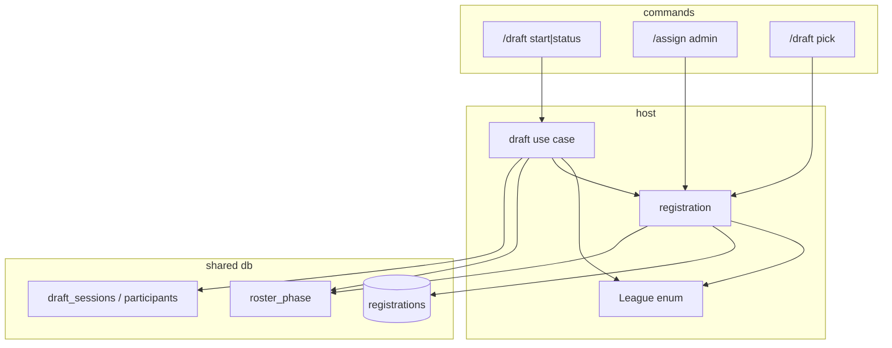

# Plan: season-draft

**Approved:** 2026-07-17  
**Base:** `cursor/multi-sport-framework-4ce5` (separate from multi-sport-framework plan)

## Status

- [x] PR 1: Schema + `DraftOrderKind` + turn math
- [x] PR 2: Draft use case (start / status / pick / complete)
- [x] PR 3: Slash commands + registration phase gates
- [x] PR 4: Docs / README

## Goal

Pre-season snake draft for a guild’s focused season: randomized pick order, one pick per turn, track whose turn, write picks to `registrations`, freeze roster when the team pool is empty.

## Architectural decisions

1. Host-owned draft engine; picks use `registrations` + `League` catalog.
2. `DraftOrderKind` enum (`Snake` now; extendable) branches turn math.
3. `draft_sessions` + `draft_participants`; turn derived from pick count + order + kind.
4. `seasons.roster_phase`: `open` | `drafting` | `frozen`.
5. `/draft pick` is free selection while open and restricted to the **on-clock** user while drafting; admin `/assign` follows the same phase rules.
6. On completion: phase `frozen`; no `/draft pick` / `/unclaim` / non-admin assign. No thaw in v1.
7. Start requires empty registrations for the season.
8. Slash-only UX; continue until unclaimed pool empty (multi-team snake).

## Design decisions

1. `next_picker(order, pick_index, kind)` pure function + unit tests (snake reverse on odd rounds).
2. Schema: `roster_phase` on seasons; `draft_sessions`; `draft_participants`.
3. Commands: `/draft start`, `/draft status`, `/draft pick`; tighten `/assign` perms + phase rules.
4. Modules: `src/draft.rs`, `src/db/draft_*.rs`, `src/commands/draft.rs`.
5. Randomize with `rand` shuffle at start.
6. Completion when `League` unclaimed list empty → session complete + frozen.

## Approach

Add phase + draft tables and order math; implement use cases; gate registration; expose slash commands; document.

## Boundaries

| Layer | Owns |
|-------|------|
| Host `draft` | Order math, start/status/pick/complete |
| Shared `db` | sessions, participants, `roster_phase` |
| `registration` | Phase gates before upsert/delete |
| `League` | Team catalog only |
| Commands | Thin adapters |

## Contracts

```
draft::start(season, users[], kind=Snake)
  pre: roster_phase=open, no registrations, users.len()>=2
  post: shuffled participants, phase=drafting, session active
  out: order + current picker

draft::current_picker(season) -> user_id
  derive: pick_index = registration count; next_picker(order, pick_index, kind)

draft::pick(season, actor, team_query)
  pre: phase=drafting, actor == current picker (or admin assign for that user)
  post: Registration upsert; if no unclaimed left → complete + frozen

registration::pick
  open: free selection
  drafting: delegate to draft turn enforcement
  frozen: rejected

registration::unclaim
  pre: phase=open

registration::assign (admin)
  drafting: assignee must be current picker
  frozen: rejected (v1)
  open: existing behavior
```

## Investigation

- `src/registration.rs`, `src/commands/registration.rs` — gates + assign perms
- `src/league.rs` — list_teams / find_team
- `src/db/season.rs`, `migrate.rs` — phase column
- Pattern: config `MANAGE_GUILD` subcommands

## Diagram



## Increments

### PR 1: Schema + `DraftOrderKind` + turn math

- **Story:** DB can store draft order/phase; pure snake turn math is tested.
- **Edits:** Fold `roster_phase` + draft tables into greenfield `CREATE_SCHEMA` (no version bump); `DraftOrderKind` + `next_picker`; season accessors.
- **Depends on:** none
- **Acceptance:**
  - [ ] Fresh DB has phase default `open` and draft tables
  - [ ] Snake unit tests (round 0 forward, round 1 reverse)
  - [ ] `cargo test` / clippy clean
- **Touch set:** `migrate.rs` (CREATE_SCHEMA only), `db/season.rs`, new `db/draft_*.rs`, new order module or `draft/order.rs`, tests

### PR 2: Draft use case

- **Story:** Start / status / pick / complete work without Discord.
- **Edits:** `src/draft.rs`; wire registration count + league unclaimed for completion.
- **Depends on:** PR 1
- **Acceptance:**
  - [ ] Start shuffles and rejects non-empty registrations
  - [ ] Pick advances turn; wrong user fails
  - [ ] Empty pool → frozen + session complete
- **Touch set:** `src/draft.rs`, `src/lib.rs`, db draft helpers

### PR 3: Commands + registration gates

- **Story:** Slash UX + claim/assign/unclaim respect phase; assign is admin + on-clock.
- **Edits:** `commands/draft.rs`; gate `registration.rs`; `/assign` → `MANAGE_GUILD`.
- **Depends on:** PR 2
- **Acceptance:**
  - [ ] `/draft start|status|pick` registered
  - [ ] `/draft pick` is free while open and turn-restricted while drafting
  - [ ] `/assign` requires manage guild; drafting only for on-clock assignee
- **Touch set:** `commands/*`, `registration.rs`

### PR 4: Docs

- **Story:** README + AGENTS know draft phases and commands.
- **Depends on:** PR 3
- **Acceptance:**
  - [ ] User-facing draft section; no false NFL claims
- **Touch set:** `README.md`, `AGENTS.md` if needed

## Tradeoffs & risks

- Turn from registration count assumes no extra registrations mid-draft (enforced by gates + empty start).
- No thaw / undo / timeout in v1.
- Multi-team snake can be long for WC-sized catalogs.

## Open questions

- **defer:** `/draft unlock` / commissioner force-pick off-clock
- **defer:** Linear order kind implementation beyond enum stub

## Plan drift

- 2026-08-21: `/draft pick` replaced `/claim` as the single member-facing team selection command and now dispatches by roster phase.
