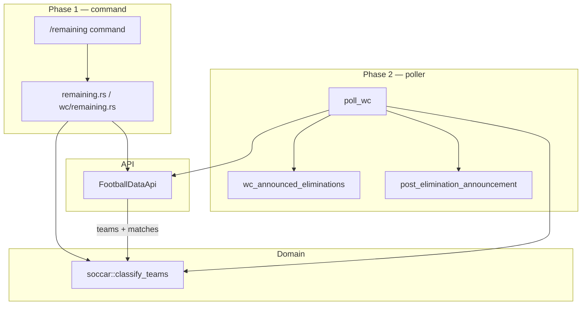

# Plan: wc-remaining

**Approved:** 2026-06-24

## Status

- [x] PR 1: WC elimination domain + API
- [x] PR 2: `/remaining` command
- [x] PR 3: Elimination announcements (phase 2)

## Goal

World Cup `/remaining` command listing teams still in vs eliminated (phase 1), then automatic elimination announcements via the poller (phase 2).

## Architectural decisions

1. **League scope** — WC only; command returns a friendly message when the guild’s default season is not WC.
2. **Data source** — Live football-data.org on each `/remaining` invocation; no DB in phase 1.
3. **API** — New `fetch_competition_matches(competition)` returning all matches with `status` and `group`.
4. **Domain** — `soccar::classify_teams` shared by command (phase 1) and poller (phase 2).
5. **Phase 2 persistence** — `wc_announced_eliminations (season_id, team_id)` for idempotency.
6. **Phase 2 trigger** — End of `poll_wc` after match upsert: classify, diff, announce.

## Design decisions

1. **WC elimination rules** — Upcoming/live fixture → still in; knockout loser → eliminated; completed group bottom two (Pts → GD → GF) → eliminated; pre-tournament all still in.
2. **Tiebreakers deferred** — Fair play and head-to-head not used; stable sort by team id on remaining ties.
3. **Return type** — `TeamClassification { still_in, eliminated }` from domain; `RemainingResult` enum at use-case boundary.
4. **Discord UX** — `/remaining`, deferred reply, embed with **Still in** / **Eliminated** sections.
5. **Phase 2 announcements** — Announce channel; mention registered owner when applicable; batch group eliminations.

## Approach

Extend football-data client → `soccar::classify_teams` + tests → WC use case + command → (phase 2) migration + poller hook.

## Boundaries

| Layer | Module | Role |
|-------|--------|------|
| API | `api/football_data.rs` | Fetch all competition matches; extended `Match` DTO |
| Domain | `soccar.rs` | Pure elimination classification |
| Use case | `wc/remaining.rs`, `remaining.rs` | WC orchestration + league guard |
| Command | `commands/wc/remaining.rs` | Discord adapter |
| DB (phase 2) | `db/wc/announced_elimination.rs` | Track announced eliminations |
| Poller (phase 2) | `poller.rs` | Classify after sync; announce deltas |

## Contracts

```
Command → remaining::list_for_guild(data, guild_id)
  output: RemainingResult::NotWorldCup | RemainingResult::Report(TeamClassification)
  invariant: WC league only

remaining → wc::remaining::fetch_report
  → fetch_teams + fetch_competition_matches → soccar::classify_teams
  invariant: names sorted alphabetically

soccar::classify_teams(teams, matches)
  invariant: still_in ∪ eliminated = all teams; disjoint buckets

Phase 2 poller (after PR 1):
  fetch_competition_matches (replaces finished-only fetch)
  → classify → diff wc_announced_eliminations → announce
```

## Investigation

- `src/api/football_data.rs` — only `fetch_finished_matches` today
- `src/soccar.rs` — add classification alongside `full_time_score`
- `src/commands/registration.rs` — `/unclaimed` embed/defer pattern
- `src/poller.rs` — phase 2 hooks `post_match_announcement` pattern
- football-data free tier: 10 req/min; phase 2 reuses widened matches fetch (no extra call)

## Diagram



## Increments

### PR 1: WC elimination domain + API

- **Story:** Pure classification from match fixtures, testable without Discord.
- **Depends on:** none
- **Acceptance:**
  - [ ] `fetch_competition_matches` returns matches with `status`, `stage`, `group`
  - [ ] Tests: pre-tournament, knockout loss, group completion
  - [ ] `cargo test` and `cargo clippy -- -D warnings` pass

### PR 2: `/remaining` command

- **Story:** Users query still-in / eliminated lists in a WC guild.
- **Depends on:** PR 1
- **Acceptance:**
  - [ ] `/remaining` embed with **Still in** and **Eliminated**
  - [ ] Non-WC season returns friendly message
  - [ ] Command in `/help`

### PR 3: Elimination announcements (phase 2)

- **Story:** Poller posts once per eliminated team to announce channel.
- **Depends on:** PR 1
- **Acceptance:**
  - [ ] Knockout loser announced once per season
  - [ ] Group eliminations on group completion
  - [ ] Owner mentioned when team registered

## Tradeoffs & risks

- Group tiebreakers beyond GD/GF may disagree with FIFA — accepted defer.
- `/remaining` is 2 API calls per invocation; burst traffic could hit 10/min free tier — optional TTL cache deferred.
- Phase 2 replaces `fetch_finished_matches` with all matches — same call count as today.

## Open questions

- **defer:** Fair-play / head-to-head tiebreakers
- **defer:** Optional 60s competition cache for `/remaining` bursts
- Phase 2 announces unassigned teams too — **yes**

## Plan drift

none
