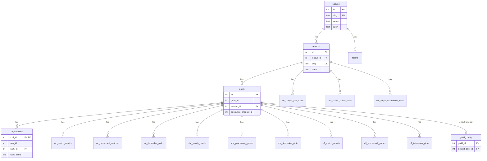

# Database schema

SQLite persistence for Discord prediction pools. Schema lives in `migrate.rs`; accessors live in one module per entity.

## Scoping

Two keys organize most data:

| Scope | Key | Used for |
|-------|-----|----------|
| **Pool** | `pool_id` | Per-guild gameplay: registrations, match results, processed flags, tie-breaker picks |
| **Season** | `season_id` | League-wide player stat totals (shared across all guild pools in that season) |

A **pool** is one Discord guild playing one **season**. Commands resolve the guild’s active pool via `GuildConfig` → `Pool::default_for_guild`.

## Entity groups

### Catalog (shared, seeded)

```
leagues ──< seasons
   │
   └──< teams
```

| Entity | Table | Role |
|--------|-------|------|
| **League** | `leagues` | Sport catalog entry (`wc`, `nba`, `nfl`). Seeded at migration. |
| **Season** | `seasons` | A competition year/edition under a league. Created via `/config season`. |
| **Team** | `teams` | Team names keyed by `(league_id, team_id)`. Upserted when users register. |

### Pool configuration

```
seasons ──< pools ──< guild_config (default_pool_id)
```

| Entity | Table | Role |
|--------|-------|------|
| **Pool** | `pools` | One guild’s instance of a season (`guild_id` + `season_id`). Holds `announce_channel_id`. |
| **GuildConfig** | `guild_config` | Maps a Discord guild to its default `pool_id` for slash commands. |

### Gameplay (per pool)

```
pools ──< registrations
pools ──< {wc\|nba\|nfl}_match_results
pools ──< {wc\|nba\|nfl}_processed_{matches\|games}
pools ──< {wc\|nba\|nfl}_tiebreaker_picks
```

| Entity | Table | Role |
|--------|-------|------|
| **Registration** | `registrations` | User claims a team in a pool. PK `(pool_id, team_id)` — one owner per team. |
| **Match result** | `wc_match_results`, `nba_match_results`, `nfl_match_results` | Finished game scores and metadata, keyed by pool. |
| **Processed flag** | `wc_processed_matches`, `nba_processed_games`, `nfl_processed_games` | Idempotency: which games the poller already announced/scored. |
| **Tiebreaker pick** | `wc_tiebreaker_picks`, `nba_tiebreaker_picks`, `nfl_tiebreaker_picks` | One player pick per user per pool for standings tie-breaks. |

### Player totals (per season)

```
seasons ──< {wc\|nba\|nfl}_player_{goal\|points\|touchdown}_totals
```

| Entity | Table | Role |
|--------|-------|------|
| **Player stat total** | `wc_player_goal_totals`, `nba_player_points_totals`, `nfl_player_touchdown_totals` | Cached league-wide player stats for tie-breakers. Keyed by `(season_id, player_id)`. |

## Full relationship diagram



## Code layout

| Layer | Path | Notes |
|-------|------|-------|
| Migrations | `migrate.rs` | `CREATE TABLE` + version bumps |
| Shared entities | `pool.rs`, `season.rs`, `league.rs`, `guild_config.rs`, `registration.rs`, `team.rs` | Catalog and pool tenancy |
| League gameplay | `wc/` (live), `nba/`, `nfl/` (schema only today) | Match results, processed flags, tie-breakers, player totals |

World Cup accessors are implemented under `wc/`. NBA and NFL tables exist in the schema for future leagues; Rust modules follow the same pattern when those leagues ship.

## Conventions

- Methods take `&Connection` and return `rusqlite::Result<T>`.
- No HTTP, Discord, or poise imports in `db/`.
- Schema changes require a bump to `SCHEMA_VERSION` in `migrate.rs`.
- Resolve the active pool through `GuildConfig` / `Pool::default_for_guild` — do not hardcode pool ids.
