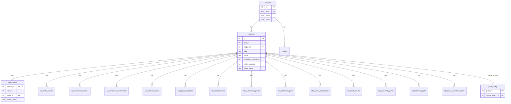

# Database schema

SQLite persistence for Discord prediction seasons. A **season** is one Discord guild tracking one league competition; all gameplay data is scoped by `season_id`.

## Entities

### Catalog

- **League** — Sport catalog entry (`wc`, `epl`, `nba`, `nfl`). Seeded on fresh schema init.
- **Team** — Team name lookup keyed by `(league_id, team_id)`. Upserted when users register.

### Guild configuration

- **Season** — One guild’s tracking of a league competition (`guild_id`, `league_id`, slug, name, announce channel, `polling_enabled`, `roster_phase`). `polling_enabled` controls whether the background poller includes the season; it is independent of which season slash commands use. `roster_phase` is `open` | `drafting` | `frozen` for claim/draft gating.
- **GuildConfig** — Maps a Discord guild to its **command focus** season (`default_season_id`) for slash commands.
- **Draft session / participants** — Pre-season draft order (`draft_sessions`, `draft_participants`) scoped by `season_id`.

### Gameplay (per season)

- **Registration** — A user claims a team in a season. One owner per team (`season_id`, `team_id`).
- **Match result** — Finished game scores and metadata (`wc_match_results`, `epl_match_results`, `nba_match_results`, `nfl_match_results`).
- **Processed flag** — Idempotency marker for games the poller already announced and scored (`wc_processed_matches`, `epl_processed_matches`, `nba_processed_games`, `nfl_processed_games`).
- **Announced elimination** — Idempotency marker for teams the poller already posted as eliminated (`wc_announced_eliminations`).
- **Tiebreaker pick** — One player pick per user per season for standings tie-breaks (`wc_tiebreaker_picks`, `epl_tiebreaker_picks`, `nba_tiebreaker_picks`, `nfl_tiebreaker_picks`).
- **Player stat total** — Cached player stats for tie-breakers (`wc_player_goal_totals`, `epl_player_goal_totals`, `nba_player_points_totals`, `nfl_player_touchdown_totals`). Keyed by `(season_id, player_id)`.

World Cup and Premier League accessors live under `db/wc/` and `db/epl/`. NBA and NFL tables exist in the schema for future leagues.

## Relationships

